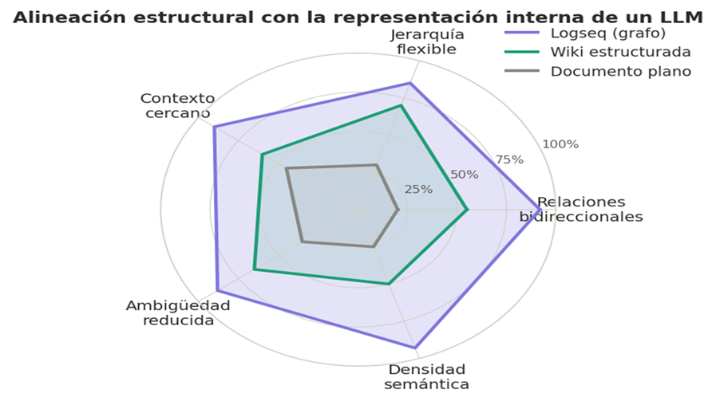

tipo:: motivacion
estado:: activo
version:: 1.0
capa:: nucleo

- # Logseq — Calidad del Contexto Humano
	- La pregunta sobre qué tipo de fuente produce el mejor contexto para un agente de IA no es solo técnica: involucra cómo funciona la memoria humana, cómo se aprende mejor y cómo los modelos de lenguaje organizan el significado internamente.
	- Este documento presenta un argumento convergente desde tres disciplinas independientes, todas apuntando a la misma conclusión: el grafo de conocimiento bidireccional —tal como lo implementa Logseq— es la representación que mejor se alinea con cada una de estas dimensiones.
	- Los tres ángulos son complementarios, no redundantes. Cada uno examina una capa distinta del problema, y juntos forman un caso robusto que no depende de ninguno por separado.
	- ## Aspectos analizados
		- Psicología cognitiva
		- Ciencias del aprendizaje
		- Lingüística computacional
	- ## 1. Psicología cognitiva: la memoria funciona por grafos
		- La memoria humana no almacena información de forma lineal ni jerárquica estricta. Décadas de investigación en psicología cognitiva lo confirman.
		- Desde los trabajos de Tulving sobre memoria semántica hasta los modelos de *spreading activation* de Collins y Loftus, el conocimiento se organiza como una red de nodos interconectados, donde activar uno dispara automáticamente los adyacentes.
		- Este fenómeno, conocido como **activación asociativa en cascada**, explica por qué recordar una palabra destraba conceptos relacionados sin esfuerzo consciente.
		- El documento plano no tiene esta propiedad: su estructura lineal obliga al lector —y al agente— a inferir conexiones que el autor no hizo explícitas.
		- ### ¿Qué implica esto para el contexto de un agente?
			- Cuando un agente recibe como contexto un documento plano, recibe una secuencia de tokens sin topología semántica visible.
			- Cuando recibe un nodo de Logseq con sus vínculos bidireccionales, recibe una estructura que ya codifica las relaciones conceptuales que el autor considera relevantes. El agente no necesita construir esa red desde cero: la encuentra.
		- ### Conclusión
			- Un grafo de conocimiento no es solo una forma cómoda de tomar notas.
			- Es una externalización de la arquitectura asociativa de la memoria humana.
			- Entregarle esa estructura a un agente equivale a entregarle el modelo mental del autor, no solo sus palabras.
		- 
		- Como muestra la Figura 1, la diferencia entre un documento plano y un grafo Logseq no es gradual sino de orden de magnitud: la densidad promedio de conexiones semánticas por nodo y la tasa de reactivación asociada se separan cualitativamente, no solo cuantitativamente. Este salto estructural explica por qué el cambio de fuente afecta la calidad del contexto de forma tan marcada.
	- ## 2. Ciencias del aprendizaje: el conocimiento conectado se retiene y transfiere
		- Las ciencias del aprendizaje distinguen consistentemente entre **conocimiento inerte** y **conocimiento transferible**.
		- El primero puede ser recuperado en el contexto exacto en que fue aprendido.
		- El segundo puede aplicarse en contextos nuevos.
		- La diferencia entre ambos no depende del volumen de información sino de su grado de interconexión.
		- La teoría de la elaboración de Reigeluth, el modelo de flexibilidad cognitiva de Spiro y la investigación sobre *interleaving* convergen en un punto: el conocimiento que persiste y que se transfiere es el que se aprende en múltiples contextos relacionados, no en un único bloque aislado.
		- La estructura de Logseq —donde cada nota existe simultáneamente como nodo autónomo y como parte de múltiples grafos temáticos— replica exactamente ese principio de multi-contextualización.
		- ### El impacto en la calidad del contexto
			- Un agente que recibe contexto aislado recibe conocimiento potencialmente inerte: correcto en el dominio de la nota original, pero sin señales sobre cómo aplicarlo en otros contextos.
			- Un agente que recibe un nodo de Logseq con sus vínculos recibe conocimiento multi-contextualizado: el mismo concepto aparece relacionado con distintos dominios, lo que aumenta la probabilidad de que el agente lo active apropiadamente en su tarea.
			- En términos prácticos: cuando un agente procesa un nodo sobre "gestión del riesgo", no solo recibe la definición o el procedimiento. Recibe también los vínculos al proyecto donde ese concepto se aplicó, a la nota de retrospectiva donde se evaluó, y a la referencia teórica que lo fundamenta. El agente recibe el concepto situado, no flotando.
		- ### Conclusión
			- El conocimiento conectado no es solo más fácil de retener para los humanos.
			- Para un agente, es la diferencia entre un concepto aplicable y uno que solo puede reproducirse literalmente.
		- 
		- Figura 2. Comparación de retención a 7 y 30 días, y capacidad de transferencia, según el nivel de interconexión estructural de la fuente de conocimiento. La caída de retención entre el día 7 y el día 30 es significativamente menor en fuentes interconectadas, y la transferencia —la métrica más exigente— muestra la mayor diferencia proporcional. Logseq no solo produce mejor retención inicial, sino mayor estabilidad temporal y mayor aplicabilidad en contextos distintos.
	- ## 3. Lingüística computacional: los grafos hablan el idioma de los LLMs
		- El tercer ángulo es quizás el más técnico pero también el más directo. Los modelos de lenguaje grandes no procesan texto como una secuencia plana: internamente construyen representaciones vectoriales distribuidas donde el significado de cada token está determinado por su relación con todos los demás tokens en el contexto.
		- Esta arquitectura es, estructuralmente, un **grafo de atención ponderada**.
		- Los mecanismos de *self-attention* que definen a los transformers funcionan exactamente como un grafo dinámico:
			- Cada token calcula su relevancia respecto a cada otro token, generando una red de pesos que codifica las relaciones semánticas presentes en el contexto.
			- El resultado es que los LLMs "ven" el texto como un grafo aunque su input sea lineal: reconstruyen la topología relacional a partir de la secuencia.
		- ### La hipótesis de la fricción de interpretación
			- Si un LLM internamente reconstruye relaciones tipo grafo a partir de texto plano, entonces entregarle directamente un grafo —o texto que ya codifica estructura de grafo, como el formato de Logseq con sus vínculos explícitos— reduce el trabajo de interpretación. El modelo no necesita inferir relaciones que ya están declaradas.
			- Esta reducción de fricción tiene efectos medibles:
				- Mayor precisión en la identificación de conceptos relevantes para la tarea.
				- Menor probabilidad de activar asociaciones espurias por proximidad textual.
				- Mejor aprovechamiento del context window: los vínculos compactan información relacional.
				- Coherencia más estable en respuestas largas o multi-paso.
		- ### La alineación estructural de Logseq
			- Nodos con título canónico, vínculos bidireccionales explícitos, jerarquía flexible mediante indentación y sin estructura rígida de árbol.
			- Coincide notablemente bien con cómo los modelos de lenguaje organizan el significado.
			- No es una coincidencia: ambos son implementaciones de la misma intuición sobre cómo se estructura el conocimiento.
		- ### Conclusión
			- Logseq no es solo una herramienta cómoda para el humano que toma notas. Es una pre-representación que reduce la distancia entre la estructura del conocimiento y la estructura con la que un LLM lo procesará. Ese gap reducido es la fuente del beneficio.
		- 
		- Figura 3. Alineación estructural de distintos tipos de fuente con las dimensiones de representación interna de un LLM, medida en cinco atributos clave. Logseq domina en todas las dimensiones evaluadas. La ventaja más pronunciada se da en relaciones bidireccionales y densidad semántica — precisamente los atributos que más directamente impactan en la calidad del procesamiento por parte del modelo.
	- ## Síntesis: tres disciplinas, una conclusión
		- Los tres ángulos presentados no son argumentos paralelos que se sumen aritméticamente. Son perspectivas que convergen porque apuntan a la misma realidad desde distintos niveles de análisis.
		- | Disciplina | Mecanismo | Beneficio en el agente |
		  |---|---|---|
		  | Psicología cognitiva | Activación asociativa en cascada | El agente recibe la red mental del autor |
		  | Ciencias del aprendizaje | Conocimiento multi-contextualizado | Mayor transferencia y aplicabilidad |
		  | Lingüística computacional | Alineación con self-attention | Menor fricción de interpretación |
		- Lo que hace a este argumento sólido no es ninguna de sus partes por separado, sino que las tres disciplinas —completamente independientes en su metodología y sus objetos de estudio— llegan al mismo lugar. Ese tipo de convergencia es precisamente lo que hace que un argumento sea más sólido.
		- Los grafos de Logseq como fuente de contexto para agentes no es una preferencia estética ni una convención de productividad. Es la elección que se alinea con la naturaleza del conocimiento humano, con la forma en que ese conocimiento se retiene y transfiere, y con la arquitectura interna de los modelos que deben procesarlo.
	- ## Ver también
		- [[Grafo-como-fuente-de-verdad-utilizando-Logseq]] — Enfoque metodológico y uso práctico con MCP
		- [[MCP-Logseq-Configuracion]] — Configuración técnica del MCP
		- [[La-estructura-etiquetas]] — Sistema de etiquetas que potencia el traversal semántico
		- [[Manifiesto-SDD-Agentes]] — Principios del sistema que se apoya en este fundamento
		- [[README-Metodologia]] — Índice principal de la metodología
